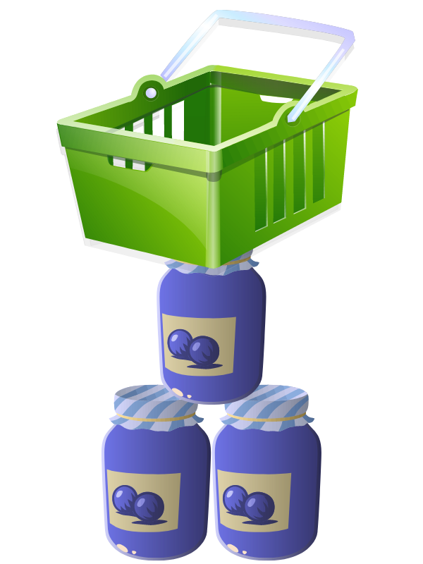
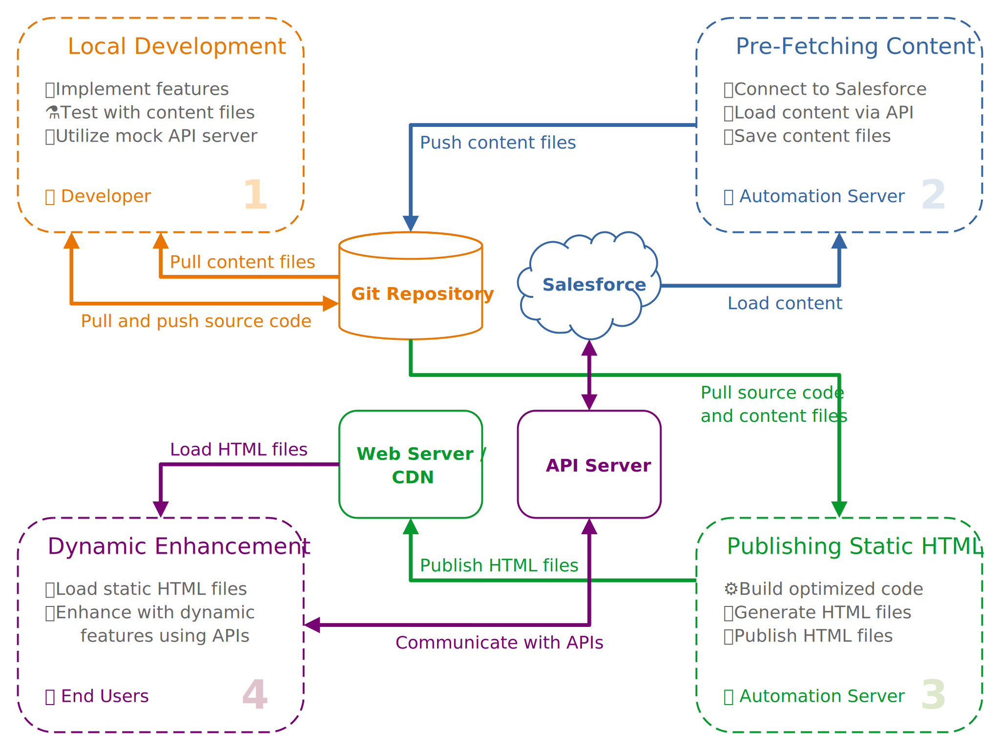
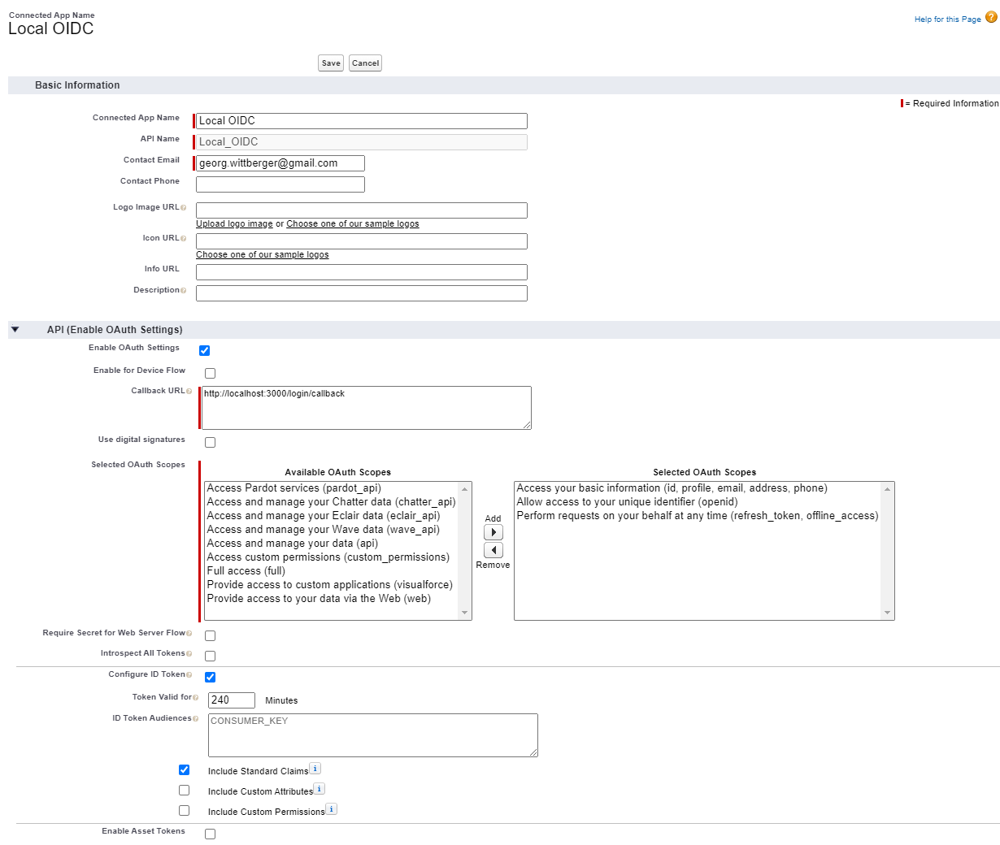

<p align="center">
  
</p>

# JAMStack E-Commerce Example

This is a showcase of an e-commerce website built with the
[JAMStack](https://jamstack.org/) using [Nuxt.js](https://nuxtjs.org) as the web
application framework and [Salesforce](https://www.salesforce.com/) as the data
storage for products and orders as well as for user authentication.

- [JAMStack E-Commerce Example](#jamstack-e-commerce-example)
  - [Example Features](#example-features)
  - [JAMStack Architecture](#jamstack-architecture)
  - [Running the Showcase](#running-the-showcase)
    - [Prerequisites](#prerequisites)
    - [Setting Up Salesforce](#setting-up-salesforce)
      - [Setting Up the Test User and Profile](#setting-up-the-test-user-and-profile)
      - [Installing the Salesforce Metadata](#installing-the-salesforce-metadata)
      - [Setting Up the Integration User](#setting-up-the-integration-user)
      - [Setting Up the Lightning Community](#setting-up-the-lightning-community)
      - [Setting Up the Connected App](#setting-up-the-connected-app)
    - [Running the Content Update Script](#running-the-content-update-script)
    - [Running the API Server](#running-the-api-server)
    - [Running the Web Application](#running-the-web-application)
  - [License](#license)

## Example Features

- **Pre-Generated Static HTML Files:** All pages that make up the website are
  pre-generated at build time. This even includes one product detail page for
  each product. These static HTML files can be served by any web server or
  Content Delivery Network (CDN).
- **Pre-fetched Product Content:** Content for products is pre-fetched from
  Salesforce using a dedicated Node.js script. This script should be executed
  before the static HTML files are generated. It fetches product data via the
  Salesforce REST API and stores the content locally as JSON files. They can be
  committed to the Git repository and are used to generate the HTML files.
- **Authentication via Salesforce:** Visitors can authenticate with their
  Salesforce customer community user via the OpenID Connect protocol. This
  requires only a minimal Lightning Community configuration and a Connected App
  in Salesforce.
- **Individual User Content:** Once logged in the website visitors can view
  their own user profile which displays their Account data from Salesforce. This
  data is fetched via the little API server so that visitors do not communicate
  directly with the Salesforce REST API.
- **Client-Side Shopping Cart:** All items added to the shopping cart are stored
  client-side in the browser's local storage. No server communication required.
  Visitors can still close the browser and have their cart content restored when
  accessing the page again (with the same browser on the same device).
- **Order Transmission to Salesforce:** Logged in visitors can place orders by
  sending their shopping cart to the API server. This server transforms the cart
  data into a proper Salesforce order and transmits the records via the
  Salesforce REST API.
- **Delegated Logout via Salesforce:** When logging out on the website visitors
  can be redirected to a special logout page in the Lightning Community to log
  them out there as well and then return to the website.

## JAMStack Architecture

<p>
  
</p>

Since the pages accessed by the website visitors are not generated dynamically
when they are requested but pre-generated and served as static HTML files, the
process of rolling out new features and content looks a little bit different
than in "traditional" web applications.

1. **Local Development:** Development of new features can be done locally.

   Nuxt.js comes with very effective tools to support a great developer
   experience like a dev server with hot module replacement and live reload.

   Content for products is stored in the Git repository alongside with the
   source code, so developers can make use of real product data during
   implementation and testing.

   API endpoints should be stubbed using some mock server, e.g.
   [WireMock](http://wiremock.org/) or
   [mockserver](https://github.com/namshi/mockserver), in order to work
   independently from real external systems. For OpenID Connect authentication
   consider setting up [KeyCloak](https://www.keycloak.org/) locally.

   _Note: This example project does not include any mock server._

2. **Pre-Fetching Content:** Everytime new or updated product data has to be
   published on the website the pre-fetched content JSON files must be updated
   in the Git repository before a new version of static HTML files is generated.

   The special Node.js content script will connect to Salesforce and fetch the
   most recent data via the Salesforce REST API. The content JSON files are
   updated accordingly and can be committed to the Git repository.

   It is completely up to you where and when this script is executed. For
   example, it can run as a [GitHub Action](https://github.com/features/actions)
   or in a CI process on [Travis CI](https://travis-ci.org/).

   _Note: Salesforce is just an example of a potential data source to acquire
   content from. Content files can also be created from any other data source._

3. **Publishing Static HTML Files:** Every commit in the Git repository
   represents a certain implementation and content state of the website which
   can potentially be published.

   The build process transforms the source code into optimized chunks and
   generates the static HTML files by computing all accessible routes for the
   implemented page components and the pre-fetched content files.

   Finally, all generated website files can be published to any web server or
   Content Delivery Network, e.g. [Netlify](https://www.netlify.com/).

   _Note: The build process can also leverage API requests to load content which
   is not stored in content files in the Git repository._

4. **Dynamic Enhancement via APIs:** Visitors are served static HTML files when
   loading the website in the browser. This is extremely fast because nothing
   needs dynamically generated on the server.

   Once the web page has loaded the dynamic JavaScript kicks in and enhances the
   page with dynamic features. This can be features like the shopping cart or
   displaying personalized user content.

   Dynamic data can be fetched by sending API requests from the browser.
   Visitors can authenticate using standard protocols like OAuth 2.0 and OpenID
   Connect to allow the website to present individual content.

## Running the Showcase

### Prerequisites

- [Node.js](https://nodejs.org/) 12.x or higher
- [Yarn](https://yarnpkg.com/) package manager
- Salesforce organization, e.g free
  [Developer Edition](https://developer.salesforce.com/signup)

### Setting Up Salesforce

#### Setting Up the Test User and Profile

Why? It enables the login with a real customer user in the Lightning Community.

1. Open Salesforce Setup and navigate to "Communities". Make sure that
   communities are enabled.
2. In the Salesforce Setup navigate to "Profiles".
3. Clone the profile "Customer Community User" to create a custom profile
   specifically for users of the new community. For example, call it "Example
   Customer User".
4. Open the Sales Cloud to create an Account and Contact for testing purposes.
   On the Contact view select the quick action "Enable Customer User".
   - Set the "User License" to "Customer Community".
   - Assign the profile created in the previous step.
   - Enter your own e-mail address to receive the welcome e-mail message once
     the user is added as member to the community.

#### Installing the Salesforce Metadata

This step is required if you are planning to use the content update script and
if you want to set up automatic logout in the Lightning Community when users log
out in the website.

Why? It adds the custom object "Product Category" to your Salesforce org and
installs a custom field on the Product2 object to let you define the category a
product belongs to. It also installs a Lightning Web Component to be used on a
special logout community page which will automatically log the user out.

1. Download and install
   [Salesforce CLI](https://developer.salesforce.com/tools/sfdxcli).
2. Open a terminal in the directory `salesforce`.
3. Connect Salesforce CLI to your Salesforce org.

   ```bash
   sfdx force:auth:web:login -a MyOrg -s
   ```

4. Deploy the SFDX project to your Salesforce org.

   ```bash
   sfdx force:source:deploy -p force-app
   ```

#### Setting Up the Integration User

Why? It allows the API server and content script to connect to Salesforce with a
specific technical user which allows for individual access control.

1. Open Salesforce Setup and navigate to "Users".
2. Create a new user.
   - Set the "User License" to "Salesforce"
   - Assign the profile "System Administrator".
   - Give the user some name like "Integration".
   - Enter your own e-mail address in order to receive the registration e-mail.
3. If you are planning to use the content update script please assign the
   permission set "Product Category Editor" to the integration user.
4. Confirm the verification e-mail and complete the user registration by
   entering a new password.
5. Log in to Salesforce with that integration user.
6. In the user menu next to the Setup icon select "Settings".
7. Navigate to "Reset My Security Token" and click the button "Reset Security
   Token". You should receive the new token via e-mail.

#### Setting Up the Lightning Community

Why? It is required to display the login page during the OpenID Connect
authentication flow.

1. Open Salesforce Setup and navigate to "All Communities".
2. Click the button "New Community" and choose the template "Build Your Own".
   Give it some arbitrary name and preferrably leave the URL blank.
3. Open the "Workspace" of the new community and go to "Administration".
4. In the "Settings" section activate the community.
5. Temporarily switch back to Salesforce Setup at "All Communities" and open the
   "Builder" of the new community. Click the "Publish" button.
6. Back in the "Workspace" of the community go to the "Emails" section and enter
   your own e-mail address in the "Sender" configuration. Make sure to confirm
   the e-mail message which is sent to you.
7. Activate the checkbox "Send welcome email".
8. In the "Members" section assign the profile previously created for customer
   community users (e.g. "Example Customer User"). You should receive a welcome
   e-mail message for the test user created before. Complete the user
   registration by entering a new password.

If you want to set up automatic logout for community users when they log out on
the website perform these additional steps:

1. Open the "Workspace" of the community and go to "Administration".
2. In the "Login & Registration" section enter the website's logout URL in the
   "Logout Page URL" field (e.g. if running the website on
   <http://localhost:3000> enter the URL <http://localhost:3000/logout>)
3. Switch back to Salesforce Setup at "All Communities" and open the "Builder"
   of the community.
4. Create a blank standard page with an arbitrary content layout (e.g. "1
   full-width column"). Give the page the name "Logout" and the URL "logout".
5. In the page settings set "Page Access" to "Requires Login".
6. Drag the custom component "JSEC Auto Logout" from the "Components" panel to
   the content region of the page. Do not be confused: This will immediately
   redirect you to an error page in Experience Builder because that component
   attempts to log the user out when rendered. This is just an indicator that
   the component works as expected.
7. Publish the changes made to the community.

#### Setting Up the Connected App

Why? It is required for the OpenID Connect authentication for website visitors
and allows the API server and content script to connect to Salesforce in a
secure way.

1. Open Salesforce Setup and navigate to the "App Manager".
2. Click the button "New Connected App" and enter the following data.
   - Connected App Name: (Choose anything you like, e.g. "Local OIDC")
   - API Name: (Choose anything you like, e.g. "Local_OIDC")
   - Contact Email: (Your e-mail address)
   - Enable OAuth Setting: Activated
   - Callback URL: <http://localhost:3000/login/callback>
   - Selected OAuth Scoped:
     - Access your basic information (id, profile, email, address, phone)
     - Allow access to your unique identifier (openid)
     - Perform requests on your behalf at any time (refresh_token,
       offline_access)
   - Require Secret for Web Server Flow: Deactivated
   - Configure ID Token: Activated
   - Token Valid for: (some reasonable session lifetime, e.g. 240 minutes)
   - ID Token Audiences: (leave empty, meaning consumer key is used)
   - Include Standard Claims: Activated
3. From the Connected App View copy the "Consumer Key" and the "Consumer Secret"
   for later use in configuration parameters.
4. Click the button "Manage" and then "Edit Policies".
5. Set the "Permitted Users" field to "Admin approved users are pre-authorized".
6. In the "Profiles" panel click the button "Manage Profiles" and assign both
   the profile previously created for customer community users (e.g. "Example
   Customer User") and the profile for the integration user (e.g. "System
   Administrator").

<p>
  
</p>

### Running the Content Update Script

This step is optional because the Git repository already contains some example
products and categories for demonstration.

You should have some records for the Product2 object in your Salesforce org
which are active and have Price Book Entries in some Price Book used for the
content update.

You may also create some Product Categories and assign them to your products.

_Note: The script requires the Salesforce metadata to be deployed in your org._

1. Open a terminal in the directory `content-scripts`.
2. Set the following environment variables.

   | Name                       | Description                                                                    |
   | -------------------------- | ------------------------------------------------------------------------------ |
   | SALESFORCE_INSTANCE_URL    | Base URL of the Salesforce instance (pattern `https://xx##.salesforce.com` )   |
   | SALESFORCE_API_VERSION     | Salesforce API version to use                                                  |
   | SALESFORCE_TOKEN_ENDPOINT  | OAuth 2.0 token endpoint of the Salesforce instance                            |
   | SALESFORCE_CLIENT_ID       | Consumer Key of the Connected App (copied before from App view)                |
   | SALESFORCE_CLIENT_SECRET   | Consumer Secret of the Connected App (copied before from App view)             |
   | SALESFORCE_USERNAME        | Username of the integration user                                               |
   | SALESFORCE_PASSWORD        | Password of the integration user + security token (simply concatenate the two) |
   | SALESFORCE_PRICE_BOOK_NAME | Optional. Price book to use. Default: "Standard Price Book"                    |

   Example:

   ```bash
   SALESFORCE_INSTANCE_URL=https://eu25.salesforce.com
   SALESFORCE_API_VERSION=49.0
   SALESFORCE_TOKEN_ENDPOINT=https://login.salesforce.com/services/oauth2/token
   SALESFORCE_CLIENT_ID=3MVG9...ru7XA
   SALESFORCE_CLIENT_SECRET=17DAD...0110F
   SALESFORCE_USERNAME=integration@georg.wittberger.force.com
   SALESFORCE_PASSWORD=abcde...KiQ9n
   ```

   _Tip: You can put these variable assignments in a file called `.env` in the
   directory `content-scripts` for development and testing._

3. Install the Node.js dependencies.

   ```bash
   yarn install
   ```

4. Run the script to update the categories and products JSON files in the
   directory `content`.

   ```bash
   yarn start
   ```

### Running the API Server

1. Open a terminal in the directory `api`.
2. Set the following environment variables.

   | Name                       | Description                                                                    |
   | -------------------------- | ------------------------------------------------------------------------------ |
   | PORT                       | Local server port to listen on. Default: 3000                                  |
   | SALESFORCE_INSTANCE_URL    | Base URL of the Salesforce instance (pattern `https://xx##.salesforce.com` )   |
   | SALESFORCE_API_VERSION     | Salesforce API version to use                                                  |
   | SALESFORCE_TOKEN_ENDPOINT  | OAuth 2.0 token endpoint of the Salesforce instance (not community)            |
   | SALESFORCE_JWKS_ENDPOINT   | OpenID Connect JSON Web Key Set endpoint of the Salesforce Lightning Community |
   | SALESFORCE_ISSUER_URL      | Issuer URL included in the ID token issued by Salesforce                       |
   | SALESFORCE_CLIENT_ID       | Consumer Key of the Connected App (copied before from App view)                |
   | SALESFORCE_CLIENT_SECRET   | Consumer Secret of the Connected App (copied before from App view)             |
   | SALESFORCE_USERNAME        | Username of the integration user                                               |
   | SALESFORCE_PASSWORD        | Password of the integration user + security token (simply concat the two)      |
   | SALESFORCE_PRICE_BOOK_NAME | Optional. Price book to use. Default: "Standard Price Book"                    |
   | SECURITY_CORS_ORIGIN       | Base URL of the web application allowed to access the server.                  |

   Example:

   ```bash
   PORT=4000
   SALESFORCE_INSTANCE_URL=https://eu25.salesforce.com
   SALESFORCE_API_VERSION=49.0
   SALESFORCE_TOKEN_ENDPOINT=https://login.salesforce.com/services/oauth2/token
   SALESFORCE_JWKS_ENDPOINT=https://georgwittberger-developer-edition.eu25.force.com/id/keys
   SALESFORCE_ISSUER_URL=https://georgwittberger-developer-edition.eu25.force.com
   SALESFORCE_CLIENT_ID=3MVG9...ru7XA
   SALESFORCE_CLIENT_SECRET=17DAD...0110F
   SALESFORCE_USERNAME=integration@georg.wittberger.force.com
   SALESFORCE_PASSWORD=abcde...KiQ9n
   SECURITY_CORS_ORIGIN=http://localhost:3000
   ```

   _Tip: You can put these variable assignments in a file called `.env` in the
   directory `api` for development and testing._

3. Install the Node.js dependencies.

   ```bash
   yarn install
   ```

4. Run the server.

   ```bash
   yarn start
   ```

### Running the Web Application

1. Open a terminal in the project root directory.
2. Set the following environment variables.

   | Name                      | Description                                                            |
   | ------------------------- | ---------------------------------------------------------------------- |
   | API_URL                   | Base URL of the API server                                             |
   | LOGOUT_URL                | Optional. Logout page URL of the Salesforce Lightning Community        |
   | OAUTH2_AUTHORIZE_ENDPOINT | OAuth 2.0 authorization endpoint of the Salesforce Lightning Community |
   | OAUTH2_USERINFO_ENDPOINT  | User info endpoint of the API server                                   |
   | OAUTH2_CLIENT_ID          | Consumer Key of the Connected App (copied before from App view)        |
   | OAUTH2_SCOPES             | OAuth 2.0 scopes to request during authentication, comma-separated     |

   Example:

   ```bash
   API_URL=http://localhost:4000
   LOGOUT_URL=https://georgwittberger-developer-edition.eu25.force.com/s/logout
   OAUTH2_AUTHORIZE_ENDPOINT=https://georgwittberger-developer-edition.eu25.force.com/services/oauth2/authorize
   OAUTH2_USERINFO_ENDPOINT=http://localhost:4000/userinfo
   OAUTH2_CLIENT_ID=3MVG9...ru7XA
   OAUTH2_SCOPES=openid,id
   ```

   _Tip: You can put these variable assignments in a file called `.env` in the
   project root directory for development and testing._

   _Note: If the variable `LOGOUT_URL` is not provided users will be redirected
   to the website's logout page immediately without external roundtrip._

3. Install the Node.js dependencies.

   ```bash
   yarn install
   ```

4. Either launch the development server which offers live reload ...

   ```bash
   yarn dev
   ```

5. ... or generate the static HTML files first and then serve these files from
   the `dist` directory.

   ```bash
   yarn generate
   yarn start
   ```

6. Open your browser on <http://localhost:3000>

## License

[MIT License](https://opensource.org/licenses/MIT)
